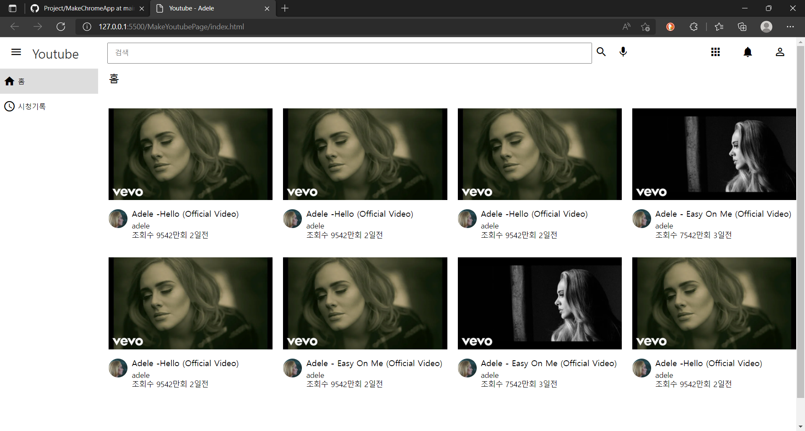
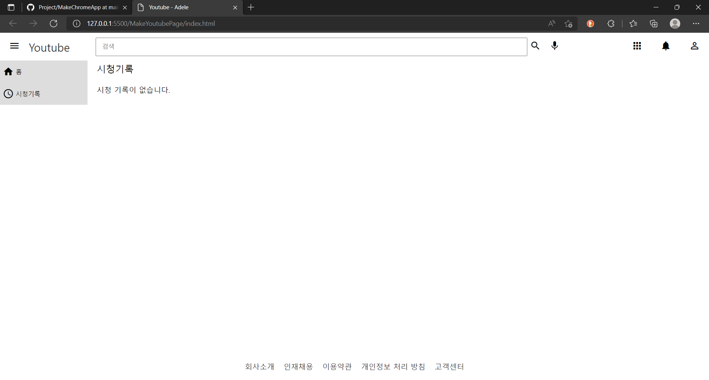

# youtube-page-toyproject

## 기술스택
- HTML
- CSS
- JavaScript

## 목표
- 적절한 시맨틱 태그를 사용한다.
- grid, flex를 활용하여 화면을 구분한다. 
- js 함수를 사용하여 data.js에 저장한 데이터들이 순서대로 화면에 보이게 한다.

## 구동화면

1. 처음 화면(사이드바에 홈버튼 클릭시)

2. 사이드바에 시청기록 클릭시

